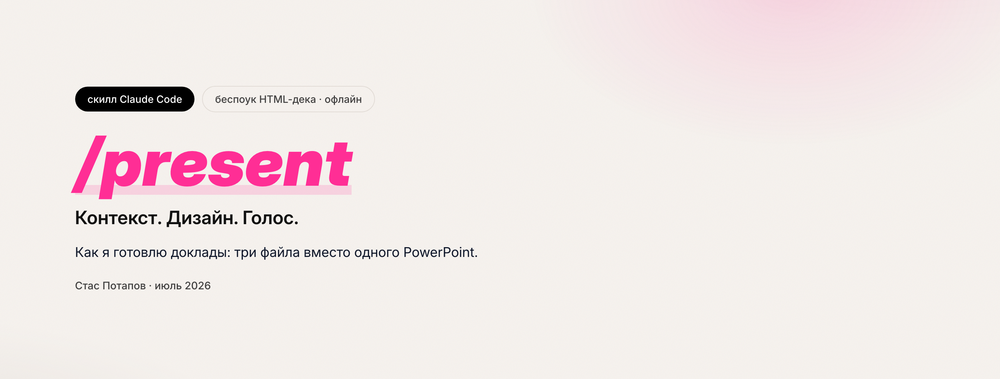
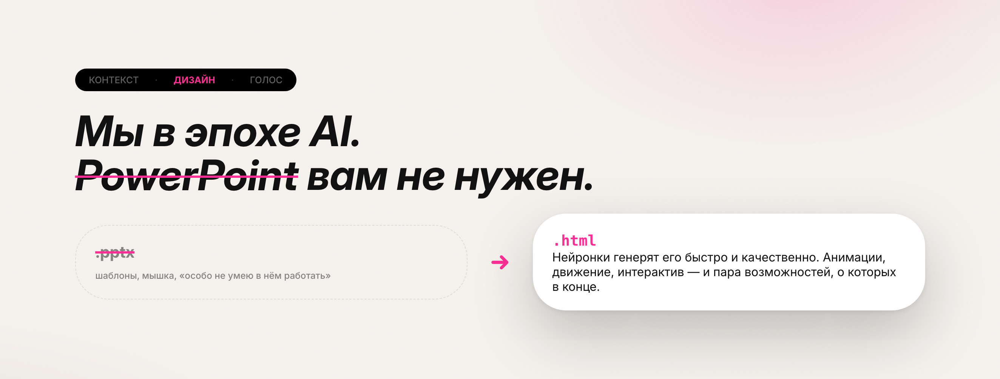

# present — скилл для Claude Code

Агентский скилл, который собирает **беспоук HTML-презентацию** (деку) по папке-контексту, тексту доклада или теме.

Не шаблон-заполнялка: Claude читает материал, сам выбирает арт-дирекшн и проектирует деку под конкретный контент — разные доклады дают визуально разные деки (структура, палитра, типографика, фон, характер движения).

На выходе — **один самодостаточный HTML-файл**: открывается офлайн в браузере, без CDN и сетевых ссылок.

---

## Как я делаю доклады: Контекст · Дизайн · Голос

Скилл — только один шаг конвейера. Сам конвейер важнее, поэтому сначала про него.

Главная идея: **три файла вместо одного**. Раньше всё лежало в одном PowerPoint — и текст, и дизайн, и речь; тянешь за одно — разваливается всё. Здесь это три разные работы с тремя артефактами. И правило ровно одно: **сначала любым способом получаем `slides.md`, и только потом занимаемся дизайном.**

### 1. Контекст → `slides.md`

Первый шаг называется «контекст», а не «слова», намеренно: **неважно, откуда взялся материал** — важно, что на выходе `slides.md`. Два основных входа, оба **голосом**:

- **Обсудить идею.** Открываешь party mode в [BMAD](https://github.com/bmad-code-org/BMAD-METHOD) на пустой папке и диктуешь свою идею свободным монологом: чего хочу рассказать, что должно быть, на что обратить внимание. Он прорабатывает и задаёт конкретные вопросы — получается сессия. На выходе `slides.md`: какие слайды и что на каждом рассказываю. Никакого дизайна.
- **Сразу на диктофон.** Если доклад уже в голове — включаешь диктофон и наговариваешь целиком, как есть. Транскрибируешь ([OpenSuperWhisper](https://github.com/Starmel/OpenSuperWhisper) локально, модель `large-v3` — на M-чипе быстро и качественно, сразу со знаками и англицизмами) и отдаёшь расшифровку в BMAD: «вот весь доклад, разложи на слайды».
- **Готовые материалы.** Контекстом может быть что угодно: статьи по теме, целый репозиторий (тогда цифры для слайдов берутся из реального `git log`), внутренние доки, чужая презентация. Скидываешь в BMAD ровно так же: «вот материал, разложи по слайдам».

Разница между первыми двумя: в первом случае доклад **придумывается** вместе с нейронкой, во втором она его **раскладывает**, имея весь материал на руках. Все пути приводят в одну точку.

> **Совет шире этого конвейера: говорите с нейронкой голосом.** Не только про доклады — с любой задачей. Рассказываешь всё, что есть по проблеме, вываливаешь мысли подряд, а она вычленяет суть. Когда говоришь, поток идёт свободнее: не редактируешь себя на ходу, не подбираешь формулировку.

### 2. Дизайн → `design.md` + дека


Мы в эпохе AI — **PowerPoint не нужен, генерим HTML**: нейронки делают его качественно и быстро, там анимации, движение, интерактив.

- **Референс.** Верстать самому не надо — надо найти стиль. Например, [styles.refero.design](https://styles.refero.design): смотришь глазами, как выглядит, и у каждого стиля **сразу лежит готовый `design.md`** — копируешь себе в папку. Дизайн есть. `design.md` — уже практически стандарт, как `README.md`: файл, где описано, как всё должно выглядеть (шрифты, цвета, формы, отступы). Можно и наоборот: написать его руками или собрать с тем же BMAD.
- **Сборка.** `/present <папка>` — скиллу нужны ровно два файла, `slides.md` и `design.md`. Он что-то переспросит, если надо, и соберёт деку. Это **база**, и база, как правило, не то, что нужно — зато потрачено мало времени, а результат уже в руках.
- **Луп правок.** Смотришь на деку и правишь её **словами**: что не нравится, что где поправить, куда добавить анимацию. Допиливать можно бесконечно.
- **[Claude Design](https://claude.ai/design) (опция, но очень советую).** После первой сборки скинь деку и свой `design.md` в Claude Design — он проверит, предложит своё решение, и оно будет рабочее. Чат плюс рабочая зона как панель в Figma: заметки кидаются прямо на макет. Входит в подписку Claude (Pro / Max / Team / Enterprise), отдельно платить не надо. Шаг необязательный — конвейер работает и без него.

`design.md` здесь — главный файл, а не украшение: один и тот же материал под тремя разными брифами даёт три совершенно разные деки.

### 3. Голос → петля назад в `slides.md`

Дека готова — и вот здесь большинство останавливается, а самое ценное дальше.

- **Прогон на диктофон.** Запускаешь деку, включаешь запись (на самом компьютере) и проходишь свои слайды вслух, своими словами, как будто зал уже сидит. Видишь ошибку — тут же вслух её и проговариваешь, всё пишется. Сразу узнаёшь две вещи: **сколько доклад длится на самом деле** и **где ты плывёшь** — там, где начал мычать, плохой слайд, а не ты.
- **Расшифровка.** [OpenSuperWhisper](https://github.com/Starmel/OpenSuperWhisper) локально → сырой текст со всей водой и всеми «эээ». Бесплатно, никуда ничего не уходит.
- **Нейронка как цензор.** Обратно в BMAD: изучи, порежь где не надо, скажи где я не прав. И главный трюк — **назови хронометраж**: «у меня двадцать минут, вот тайминги по слайдам, ужми». Подрежет ровно то, что не жалко. На выходе — **твои слова**, просто причёсанные, а не то, что нейронка нафигачила от себя.
- **Обратно в `slides.md`** и пересборка. Теперь в деке лежит то, что ты реально говоришь, — слайды подтянулись под живую речь, а не наоборот.

Ради этой стрелки всё и разносилось на три файла: каждый круг доклад становится короче и точнее, а переделывать заново ничего не надо.

### Два круга

| Круг | Что меняет | Как |
|---|---|---|
| **Большой** | *что* я говорю — структура, порядок, дизайн | правка `slides.md` → пересборка деки |
| **Малый** | *какими словами* — формулировки | правка заметки прямо в окне докладчика → выгрузил `notes.js` → положил рядом с декой. Ни редактора, ни пересборки |

Малый круг крутится столько раз, сколько раз ты прогнал доклад вслух.

### Инструменты конвейера

| Шаг | Инструмент | Зачем | Обязателен? |
|---|---|---|---|
| Контекст | [BMAD METHOD](https://github.com/bmad-code-org/BMAD-METHOD) | party mode и саб-агенты под презентации и сторителлинг: раскрутить идею, разложить расшифровку по слайдам, потом причесать текст под хронометраж | нет — годится любой чат, где можно обсудить текст |
| Контекст / Голос | [OpenSuperWhisper](https://github.com/Starmel/OpenSuperWhisper), модель `large-v3` | локальная транскрипция диктофона: обёртка над whisper.cpp для macOS — глобальный хоткей на диктовку, drag & drop записей, модели качаются из самого приложения. Быстро на M-чипе, со знаками и англицизмами, бесплатно и офлайн | нет — годится что угодно, что кладёт текст в поле ввода (в macOS есть и системная диктовка) |
| Дизайн | [styles.refero.design](https://styles.refero.design) | галерея чистых референсов, у каждого стиля лежит готовый `design.md` — копируешь себе в папку | нет — `design.md` можно написать руками или собрать с BMAD |
| Дизайн | **этот скилл** | `slides.md` + `design.md` → один офлайн HTML с presenter-окном и экспортом в PDF | — |
| Дизайн | [Claude Design](https://claude.ai/design) | прогнать готовую деку с её `design.md`: проверит, предложит рабочее решение; заметки прямо на макет | нет — входит в подписку Claude, но конвейер работает и без него |

---

## Что умеет готовая дека

- Листается `←` `→`, колесом мыши, свайпом; позиция хранится в `#хэше` — F5 не сбивает слайд.
- `P` — **окно докладчика**: заметки, следующий слайд, таймер, переключение слайдов отсюда же. В идеале два монитора: один стримишь, второй перед тобой. Шарить на экран нужно деку, не его.
- Заметки правятся **прямо в этом окне**: двойной клик по тексту → поправил → применил. Замычал на репетиции — тут же переформулировал, пока мысль свежая.
- `B` — чёрный экран, `F` — fullscreen.
- `S` — **экспорт в PDF**: kernel замораживает все слайды в финальном кадре (счётчики досчитаны, анимации доиграны), страница 16:9 без полей, слайд = страница, текст остаётся текстом. Попросят «пришлите слайды» — есть что прислать.
- `?check` в адресе — подсветка слайдов, где контент выше экрана.
- **Живые заметки** в файле `<slug>-notes.js` рядом с декой: правятся в presenter-окне или во внешнем редакторе — подхватываются на лету без пересборки. Копия вшита в HTML как fallback, так что деку можно переслать одним файлом.

Дека открыта как локальный файл, а из локального файла браузер на диск писать не умеет — поэтому правки заметок живут черновиком в браузере (F5 переживают), а на диск переносятся кнопкой «⤓ notes.js»: скачал, положил рядом с декой поверх старого. Файл главнее черновика; несохранённые правки не теряются — presenter предложит их вернуть.

## Установка

Скилл ставится копированием в каталог skills — глобально (доступен во всех проектах) или локально в проект.

Глобально:

```bash
git clone git@github.com:StasPotapov/present.git ~/.claude/skills/present
```

Или в конкретный проект:

```bash
git clone git@github.com:StasPotapov/present.git .claude/skills/present
```

Проверить, что Claude Code видит скилл: `/present` в списке команд.

## Использование

```
/present <папка-контекст | файл | тема | URL-референс>
```

На вход лучше всего заходит **папка с контекстом**:

```
my-talk/
├── slides.md     # текст по слайдам + заметки спикера
├── design.md     # дизайн-бриф (арт-дирекшн)
└── *.png/jpg     # медиа для встраивания
```

Два входных файла — обязательное условие сборки:

- **`slides.md`** — что говорится: разбивка по слайдам (`---`, `## Слайд N` или заголовки), пары «тезис слайда → заметка спикера».
- **`design.md`** — как выглядит: дизайн-бриф. Экспорт со styles.refero.design (палитра-токены, типо-шкала, компоненты, Do/Don't, готовый `:root`) применяется точно.

Чего нет — Claude доберёт коротким интервью (или поможет найти готовый бриф) и **сохранит файлом**, и только потом покажет план деки. Если оба файла уже есть — интервью пропускается.

Работает и без папки: сырой текст доклада, расшифровка, тезисы, одна тема, путь к репозиторию (тогда цифры для слайдов-доказательств берутся из реального `git log`), URL-референс для извлечения дизайн-ДНК.

Контент скилл **не выдумывает** — числа и факты берутся из материалов или уточняются вопросом.

## Что получается на выходе

Твоя рабочая папка остаётся твоей: материалы, сырьё и исходники лежат где лежали. Всё, что нужно деке для показа, скилл складывает в отдельную подпапку `deck/` — её можно целиком заархивировать и унести на любой ноутбук, ничего не выбирая руками.

```
доклад/
├── slides.md                    вход: текст по слайдам
├── design.md                    вход: дизайн-бриф
├── transcript.md · *.jpg        сырьё и материалы — не тронуты
├── src/ · build.py              исходники сборки (если дека собиралась скриптом)
├── DECK.md                      манифест: карта слайдов, решения с их «почему», как править
└── deck/                        ← самодостаточная папка показа
    ├── <slug>-<дата>.html       сама дека
    ├── <slug>-<дата>-notes.js   живые заметки (источник правды после первой генерации)
    └── deck-assets/             только если медиа не влезло в base64
```

`DECK.md` нужен, чтобы в следующей сессии не вычитывать монолитный HTML целиком: там карта слайдов и принятые решения с обоснованием. Собиралась скриптом — правятся исходники в `src/` и пересобирается, а не готовый HTML.

## Пример


В [`example/`](example/) лежит настоящая дека, собранная этим скиллом и прошедшая весь конвейер выше, — доклад «Контекст. Дизайн. Голос.», 17 слайдов. Там же её входы (`slides.md`, `design.md`), манифест `DECK.md` и скрипт сборки с исходниками, так что видно и раскладку папки, и режим «скрипт».

```bash
git clone git@github.com:StasPotapov/present.git
open present/example/deck/kontekst-dizayn-golos-2026-07-28.html
```

## Устройство скилла

| Файл | Что это |
|---|---|
| `SKILL.md` | процесс: ингест → арт-дирекшн → гейт входных файлов → план → сборка → валидация → доводка |
| `assets/kernel.html` | движок деки (KERNEL v5): навигация, аниматоры, presenter-окно, экспорт в PDF. Копируется **дословно**, весь визуал пишется в его `<style id="design">` и слайды в `#deck` |
| `assets/art-direction.md` | как спроектировать визуал под контент; как применять `design.md`; источники брифов |
| `assets/cookbook.md` | библиотека рецептов-компонентов, контракт классов kernel (`.count`, `.chain`, `.clist`, `.pipeline`, `[data-type]`…), пример полного арт-дирекшна, контракт самодостаточности |
| `assets/deck-template.md` | скелет `DECK.md` |
| `assets/validate.py` | валидатор готовой деки |

### Валидатор

```bash
python3 assets/validate.py <дека>.html
```

Проверяет целостность kernel (маркер `KERNEL v5`, базовые и print-стили, chrome, presenter, правку заметок, экспорт в PDF), остаточные `{{…}}`, сетевые ссылки, синтаксис JS (`node --check` для kernel и notes.js), синхронность секций `notes.js` со слайдами, наличие `slides.md` / `design.md` / `DECK.md`.

## Требования

- Claude Code.
- Для валидатора — `python3` (stdlib) и `node` (для `--check`).
- Экспорт в PDF проверен в Chrome; из Safari результат стоит сверить глазами.

Никаких `npm install` / `pip install`: скилл использует только преустановленные инструменты. Шрифты — системные стеки либо вшитый base64 open-source шрифт (с согласия, единственное разрешённое сетевое действие на сборке).

## Язык

Скилл общается по-русски.

---

Пользуйтесь. Но использовать именно этот скилл — не обязательно: **напишите свой**. Когда сам такое сделаешь и поймёшь, что можешь создать себе что угодно под себя, — вот тогда и понимаешь настоящую силу нейронок.
